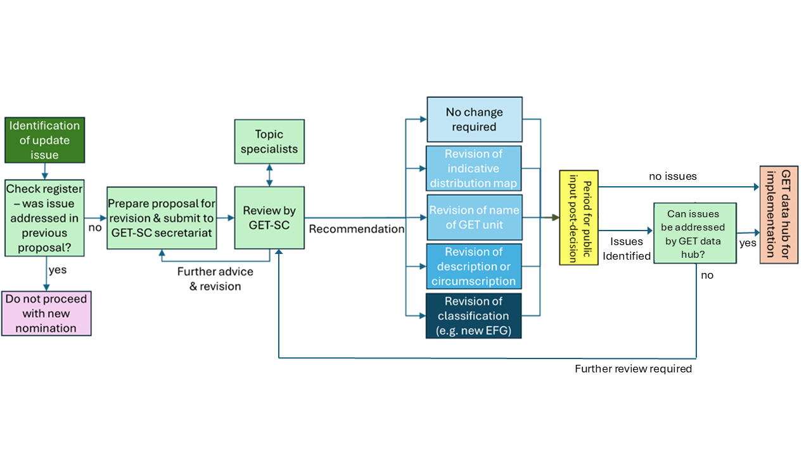

[Download this document (and appendices) as a PDF](assets/GET-SC-process-for-nomination-and-consideration-of-changes-to-GET_Final_17Sept2025.pdf){target="data-hub"}

### Background

The International Union for Conservation of Nature (IUCN) Global
Ecosystem Typology (GET) is a global classification system that provides
a consistent framework for describing and classifying ecosystems. It
distinguishes functionally different groups of ecosystems at its upper
levels and compositionally distinct expressions of functional types at
lower levels. Its lowest level provides a means of integrating
nationally- and locally-based classifications into the global framework.

Since development in 2020, the GET has rapidly gained status as a global
policy instrument. It provides the reference classification for assets
in ecosystem accounts based on the UN System for Environmental Economic
Accounts -- Ecosystem Accounts (SEEA-EA); and is used for reporting on
targets and goals of the UN Convention on Biological Diversity (e.g. for
Headline Indicators of the UN Kunming-Montreal Global Biodiversity
Framework).

This wide usage of the GET in connection with international policy
agreements requires temporal stability in the structure and
interpretation of GET classification units. On the other hand, there is
a need to maintain the GET as a 'living resource' with updates that are
responsive to advances in knowledge.

The GET Scientific Committee, comprising international experts in
terrestrial, freshwater and marine ecosystems evaluates the need for
specific updates to the GET, seeking external advice as needed. In
evaluating proposed updates, the Committee will have regard to the
trade-off between temporal consistency and structural stability of the
GET and ensuring that the typology reflects current scientific
knowledge. It will consider alternative types of adjustments to the GET
to accommodate identified advances in knowledge while minimising the
impact on users by limiting structural changes. Significant adjustments
to the GET will only be endorsed if their benefits are clearly justified
and outweigh the 'costs' in terms of temporal instability in the
typology. The purpose of this proforma is to enable open input from the
user community on updates to the GET and to gather the necessary
information for scientifically rigorous evaluation of proposed
adjustments, their benefits to the wider user community and their costs
to structural stability.

### Adjustment types

This process is for proposed adjustments to the Global Ecosystem
Typology Levels 1 -- 3, particularly Ecosystem Functional Groups (EFGs),
which comprise Level 3. The process will be adapted to address
adjustments to Levels 4 -- 5 as their structure develops. Updates at
Levels 6 are managed by local authorities and are outside the scope of
this process.

Different types of adjustment to EFGs are likely to have different
implications for temporal consistency of application of the GET. Four
types of adjustment with increasing levels of expected impact on the
temporal stability of the GET include:

> I\) updates to indicative distribution maps;
>
> II\) changes to names of GET units;
>
> III\) changes to descriptions of GET units; and
>
> IV\) structural changes to the classification units.

The type of adjustment should be identified and justified at the
proposal stage and will be reviewed by the GET-SC in formulating its
recommendation (Figure 1). The Global Ecosystem Atlas
(<https://globalecosystemsatlas.org>), actively under development in a
partnership led by the Group on Earth Observations (GEO) with IUCN and
other parties, will provide an important source of map updates for the
GET (Type I adjustments). Proposed Type IV adjustments require the
strongest justification and careful consideration by the GET-SC, in
conjunction with evidence of consultation and advice from specialists on
the ecosystems for which adjustments are proposed (Figure 1).
Adjustments with higher impact on structural stability will precipitate
adjustments to multiple components of the Typology. For example, a
structural adjustment creating a new Ecosystem Functional Group (EFG)
will require new descriptive profiles and indicative distribution maps,
as well as adjustments to those of other EFGs related to the new EFG. In
evaluating the benefits and costs of proposed adjustments, the GET-SC
will also consider the likely burden of updates to the information
systems of user organisations.

*Figure 1: Overview of process for proposing and review of adjustments
to the IUCN Global Ecosystem Typology.*

### Process for proposed adjustments

Issues relevant to updating the GET have historically been flagged from
several sources: via feedback from the GET website's Feedback form, at
GET workshops, and via correspondence with GET authors and IUCN staff.

A public interface for proposed adjustments to the GET is available via
the current GET website (<https://global-ecosystems.org/>), with
submissions collated by the GET-SC secretariat. The website includes a
[public register of proposed adjustments and outcomes](register.qmd) to limit multiple
proposals for the same adjustment. This should be checked by users prior
to preparing and lodging proposals.

:::{.aside}
The public interface and register is temporarily hosted in this website.
:::

Each submission needs to describe in detail the problem with the current
GET content and how it is best to be resolved, with justification for
the proposed adjustment, noting strong justification is required.

## Process for consideration of adjustments

The process for consideration of proposed adjustments by the Global
Ecosystem Typology Scientific Committee (GET-SC) will follow the outline
provided in Figure 1.

Submissions for proposed updates will be considered by the GET-SC, in
two rounds each year. The GET website has details of deadline dates for
submissions in each round. Proposals with insufficient justification
will not be considered further and nominators will be notified.

The Committee's review may be informed by consultations with subject
matter experts where needed and may involve seeking additional
information from the nominator.

Table 1: Process for reviewing and implementing adjustments to the GET
by adjustment type

+--------------------------+-------------------------------------------+
| **Type of adjustment     | **Process for review**                    |
| proposed**               |                                           |
+==========================+===========================================+
| I\) updates to           | Seek input from Global Ecosystem Atlas    |
| indicative distribution  | (GEA) content team on compliance of       |
| maps (typically proposed | proposed maps with GEA data standards     |
| as alternative source    |                                           |
| maps);                   | Seek input from original authors of EFG   |
|                          | profile and/or other experts as required  |
|                          |                                           |
|                          | GET-SC review of merits and limitations   |
|                          | of proposed map relative to existing map  |
|                          | data based on:                            |
|                          |                                           |
|                          | -   Does map faithfully represent the     |
|                          |     relevant EFG concept                  |
|                          |                                           |
|                          | -   Outcome and efficacy of accuracy      |
|                          |     assessment                            |
|                          |                                           |
|                          | -   Extent of global coverage             |
|                          |                                           |
|                          | -   Spatial resolution                    |
|                          |                                           |
|                          | -   Data freshness                        |
|                          |                                           |
|                          | -   License, copyright documentation      |
|                          |                                           |
|                          | -   Availability of current and historic  |
|                          |     projections                           |
|                          |                                           |
|                          | GET-SC recommendation on map with reasons |
+--------------------------+-------------------------------------------+
| II\) changes to names of | Seek input from original authors of EFG   |
| GET units;               | and/or other experts as required          |
|                          |                                           |
|                          | GET-SC review of need, merits (in terms   |
|                          | of improved clarity) and limitations (in  |
|                          | terms of user experience) of proposed     |
|                          | name change                               |
|                          |                                           |
|                          | GET-SC recommendation on updated name/s   |
+--------------------------+-------------------------------------------+
| III\) changes to         | Seek input from original authors of EFG   |
| descriptions of GET      | and/or other experts as required          |
| units                    |                                           |
|                          | GET-SC determines whether proposed        |
|                          | adjustments alter circumscription of unit |
|                          | or only adds detail                       |
|                          |                                           |
|                          | GET-SC reviews benefits of additional     |
|                          | detail relative to the need for concise   |
|                          | description                               |
|                          |                                           |
|                          | GET-SC reviews how altered                |
|                          | circumscription might benefit             |
|                          | interpretation of the targeted unit and   |
|                          | related units, relative to need for       |
|                          | structural stability of the GET and       |
|                          | implications for cross-referencing to     |
|                          | other classifications                     |
|                          |                                           |
|                          | GET-SC may revise proposed adjustments to |
|                          | description with input from nominator as  |
|                          | required                                  |
|                          |                                           |
|                          | GET-SC recommendation on revised          |
|                          | description                               |
+--------------------------+-------------------------------------------+
| IV\) structural changes  | GET-SC reviews justification for proposed |
| to classification units  | adjustments to GET structure. Does        |
| (addition or deletion of | proposed adjustment:                      |
| classes, or significant  |                                           |
| alterations to           | -   address a major global gap or         |
| circumscription).        |     significant improvement in            |
|                          |     representation of units consistent    |
|                          |     with the ecosystem concept, and the   |
|                          |     level of the GET                      |
|                          |                                           |
|                          | -   reflect a significant advance in      |
|                          |     understanding functionally            |
|                          |     distinctive ecosystem types           |
|                          |                                           |
|                          | -   involve benefits (above) that         |
|                          |     outweigh likely trade-offs in terms   |
|                          |     of temporal consistency, complexity   |
|                          |     and existing cross-referencing of the |
|                          |     GET with regard to user experience?   |
|                          |                                           |
|                          | Text, diagrams and maps drafted for the   |
|                          | profile of any new class and necessary    |
|                          | adjustments to profiles of existing       |
|                          | classes, with input from nominators       |
|                          | and/or other experts as required          |
|                          |                                           |
|                          | Review GET-SC and other topic experts     |
|                          |                                           |
|                          | Recommendation on updated structure and   |
|                          | text/maps by GET-SC                       |
+--------------------------+-------------------------------------------+

## Period for public review of proposed revisions

Following review of proposed adjustments and drafting of any required
changes, the proposed adjustments will be made available for public
review via the GET website (Figure 1). The period for comments or
submissions on proposed adjustments will be 6 months but may be adjusted
in the future. Major issues raised during the submission period will be
reviewed by the GET data hub, with proposals requiring major changes or
consultation referred back to the GET Scientific Committee for further
consideration. Proposals that have no issues identified, or minor
changes required, will be handled and implemented by the GET Data Hub.

## Adjustment implementation and feedback 

Accepted adjustments will be implemented by drafting, revising and
reviewing maps, text, schematics and EFG structure as required.

Once adjustments have been recommended by the GET-SC, they will send
materials to the GET data hub for implementation as updates to the GET
website and geospatial archive.

Adjustments will be implemented in successive updates to the GET website
and documented in a log for inclusion in future published versions of
the GET, and their translations to other languages, ensuring that
explicit version control is applied.

Recommendation outcomes will also be sent to the person or organisation
who proposed the adjustment.

## Appendices

### Appendix 1 – Proposal for an adjustment to the Global Ecosystem Typology (GET)  

[Download Appendix 1 as a DOCX file](assets/Appendix-1.docx){target="data-hub"}

### Appendix 2 – Examples of proposed adjustments

[Download this document and both appendices as a PDF file](assets/GET-SC-process-for-nomination-and-consideration-of-changes-to-GET_Final_17Sept2025.pdf){target="data-hub"}
