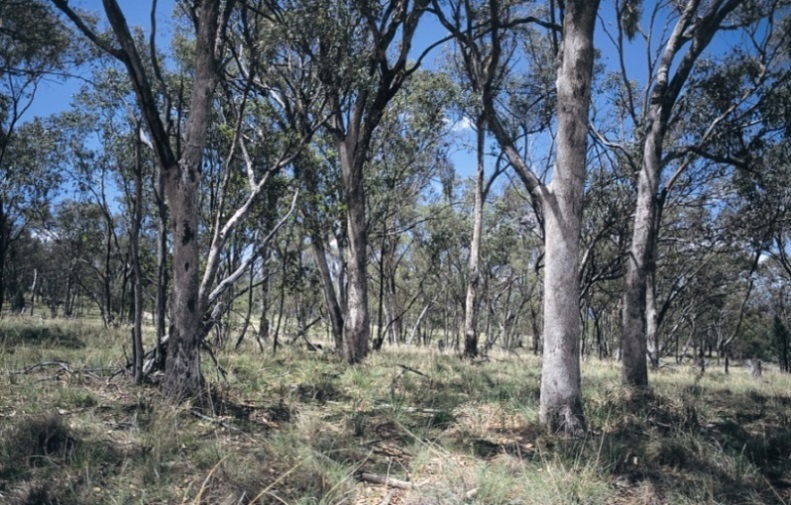
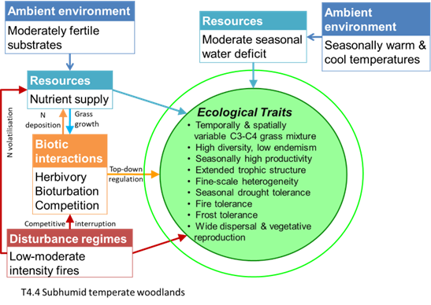
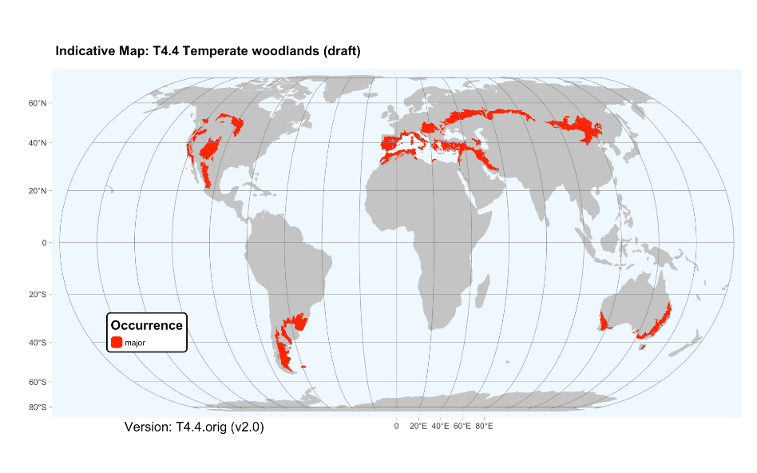

:::{.callout-note}
## Proposed revision

***Revision summary***: Rename T4.4 Subhumid temperate woodlands	

***Origin***: Australian NEAP project.

***Justification***: Adjustment to accommodate T5.6

Proposal considered by GET-SC on 8/9/2025 and approved  for public consultation on draft update

See new profile text below with [changes highlighted]{.mark}, compare to current text at [global-ecosystems.org (opens in new tab)](https://global-ecosystems.org/explore/groups/T4.4){target=blank}
::: 

## T4.4 [Sub-humid]{.mark} temperate woodlands

{width="4.022222222222222in"
height="2.5555555555555554in"}

***Ecosystem properties***: These
structurally simple woodlands are characterised by space between open
tree crowns and a ground layer with tussock grasses, interstitial forbs,
and a variable shrub component [but generally less dense and/or less
sclerophyllous than in pyric ecosystems of the Temperate forests biome
(T2)]{.mark}. Grasses with C3 and C4 photosynthetic pathways are
[both]{.mark} common but [vary, with C3 grasses predominating in winter,
at locally moist sites, cold sites, or areas without summer rainfall,
and]{.mark} C4 grasses [abundant under the opposite conditions]{.mark}.
The ground flora varies [with rainfall seasonally and]{.mark}
inter-annually, [with many forbs having perennial organs below ground
that produce shoots when soils are moist. However, xeric traits are not
strongly represented.]{.mark} Trees generate spatial heterogeneity in
light, water, and nutrients, which underpin a diversity of microhabitats
and mediate competitive interactions among plants in the ground layer.
Foliage is mostly microphyll, evergreen and transmitting abundant light,
or deciduous in colder climates. Plant and invertebrate diversity may
therefore be relatively high at local scales, but local endemism is
limited due to long-distance dispersal. Productivity is relatively high
as grasses rapidly produce biomass rich in N and other nutrients after
rain, sustaining a relatively complex trophic network of invertebrate
and vertebrate consumers. Large herbivores and their predators are key
top-down regulators. Bioturbation by fossorial mammals influences soil
structure, water infiltration, and nutrient cycling. The fauna is less
functionally and taxonomically diverse than in most tropical savannas
([T4.1](https://global-ecosystems.org/explore/groups/T4.1) and
[T4.2](https://global-ecosystems.org/explore/groups/T4.2)), but includes
large and small mammals, reptiles, and a high diversity of birds and
macro-invertebrates, including grasshoppers, which are major consumers
of biomass. Plants and animals tolerate and persist through periodic
ground fires that consume cured-grass fuels, but few have specialised
traits cued to fire (cf. pyric ecosystems such as
[T2.6](https://global-ecosystems.org/explore/groups/T2.6)).

{width="3.647222222222222in" height="2.5868055555555554in"}

***Ecological drivers***: A water deficit occurs seasonally in summer,
driven primarily by peak evapotranspiration in warm-hot [summers]{.mark}
and, in some regions, winter-maximum rainfall patterns. Mean annual
rainfall is 350--1,000 mm, [higher than in semi-arid woodlands]{.mark}.
Low winter temperatures and occasional frost and snow may limit the
growing season to 6--9 months. Soils are usually fine-textured and
fertile, but N may be limiting in some areas. Fires burn mostly in the
ground layers during the drier summer months at decadal intervals.

***[Distribution]{.mark}***: Temperate
[subhumid]{.mark} southeast and southwest Australia, Patagonia and
Pampas of South America, western and eastern North America, the
Mediterranean region, and temperate Eurasia.

{width="7in"}

### References:

Davis FW, Baldocchi DD, Tyler CM (2019) Oak woodlands. *Ecosystems of
California* (Eds. HA Mooney, E Zavaleta). Chapter 25 pp 509-534.
University of California Press, Berkeley.

Gibson GJ (2009) *Grasses and grassland ecology* Oxford University
Press, Oxford.

Prober SM, Gosper CR, Gilfedder L, Harwood TD, Thiele KR, Williams KJ,
Yates CJ (2017) Temperate eucalypt woodlands. *Australian vegetation*
(Ed. DA Keith), pp 410-437. Cambridge University Press, Cambridge

## Public consultation

<iframe width="640px" height="480px" src="https://forms.office.com/Pages/ResponsePage.aspx?id=pM_2PxXn20i44Qhnufn7o5MI4sLPZtBBnmqBEb5y9ApUM1hURU4zTldFOUJWOFpPUlhZSUFLMTkyMC4u&embed=true" frameborder="0" marginwidth="0" marginheight="0" style="border: none; max-width:100%; max-height:100vh" allowfullscreen webkitallowfullscreen mozallowfullscreen msallowfullscreen> </iframe>