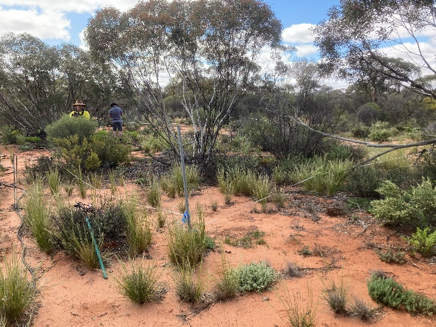
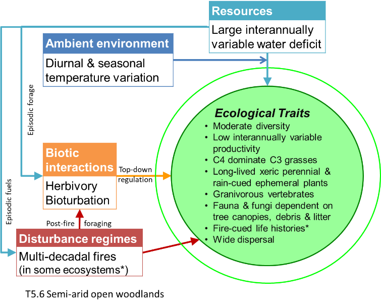
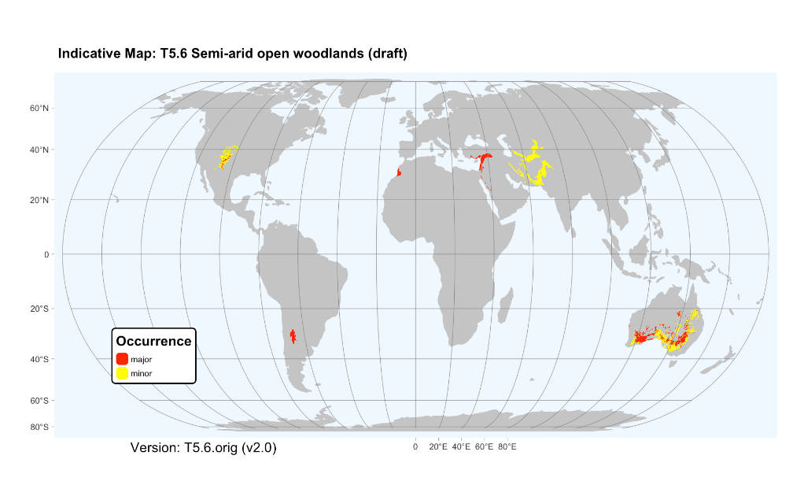

:::{.callout-note}
## Proposed revision

***Revision summary***: Describe T5.6 Semi-arid woodlands	

***Origin***: Australian NEAP project.

***Justification***: Revision resolves conflated variation along two independent environmentl gradient within the current formulation of T4.4: aridity and temperature related to

***Current status***: Proposal considered by GET-SC on 8 Sep 2025, drafft update in preparation.

::: 

## T5.6 Semi-arid open woodlands

{width="3.334722222222222in"
height="2.501388888888889in"}

***Ecosystem properties***: These
ecosystems include a sparse to open layer of low trees commonly 3-10 m
tall, with an open cover of shrubs and highly variable and ephemeral
ground vegetation of grasses and forbs. They differ from T4.4 Subhumid
temperate woodlands in having sparser vegetation with lower stature,
lower and more interannually variable productivity, and greater
representation of xeric traits and opportunist life cycles in both
plants and animals. Trees and long-lived shrubs are evergreen
stress-tolerators with slow growth rates, low or intermittent fecundity,
deep and laterally extensive root systems, and nanophyll-microphyll
leaves with low SLA, sunken diurnally regulated stomates, thick
cuticles, hairs, heat-reflective coloration and vertical orientation.
They structure habitats of vertebrates and invertebrates dependent on
tree canopies, woody debris and leaf litter. Many grasses, forbs and
some shrubs have short-lived standing plant phases and long-lived soil
seed banks cued by substantial rainfall events and, in some cases,
seasonal dormancy to avoid desiccating summers. Grasses may include
species with either C3 or C4 photosynthetic pathways, but C4 is
typically dominant. Most mammals are nocturnal, sheltering below ground
or under shade trees during hot days. They include fossorial species
that contribute to soil turnover and nutrient cycling, species with
physiological and behavioural water conservation traits, as well as
small mammals whose populations fluctuate with interannual rainfall
variation. Granivory is conspicuous among birds and small mammals, while
herbivores with medium body sizes may influence vegetation structure and
composition, particularly recruitment of long-lived woody plants. Some
semi-arid woodlands are fire-prone and include species with fire-cued
life histories.

{width="3.432638888888889in" height="2.7631944444444443in"}

***Ecological drivers***: These open ecosystems are transitional on a
water balance gradient between deserts and grassy ecosystems. They
experience a substantial, interannually variable water deficit, peaking
with evapotranspiration in hot summers. Mean annual rainfall is 200--500
mm, weakly seasonal. Temperatures may fall below zero in winter. Soils
may be fine-textured or sandy, red or pale, with moderate to low
fertility and reliably moist only at depth. While some ecosystems within
this group are not fire-prone, others experience canopy fires at
multi-decadal intervals, driven largely by ephemeral fuels after wet
periods.

***Distribution***: Semi-arid regions of
southern Australia, South America, western and eastern North America,
the Mediterranean region, and Eurasia.

{width="7in"}

### References:

Keith DA, Simpson CC, Tozer MG (2020) Mallee and maarlok ecosystems of
southern Australia. In: 'Encyclopedia of the world's biomes' (Eds. MI
Goldstein, DA DellaSala), pp869-879. Elsevier, Amsterdam.

Muldavin E, Triepke FJ (2020) North American pinyon--juniper woodlands:
Ecological composition, dynamics and future trends. In: 'Encyclopedia of
the world's biomes' (Eds. MI Goldstein, DA DellaSala ), pp 516-531.
Elsevier, Amsterdam.

Oyarzabal M, Clavijo J, Oakley Let al. (2018). Vegetation units of
Argentina \[dataset\]. Southern Ecology 28, 40--63.

White F (1983) The vegetation of Africa. A descriptive memoir to
accompany the vegetation map of Africa. UNESCO, Geneva.

## Public consultation

<iframe width="640px" height="480px" src="https://forms.office.com/Pages/ResponsePage.aspx?id=pM_2PxXn20i44Qhnufn7o5MI4sLPZtBBnmqBEb5y9ApUQkxLVEVBRTVSSDBTSUdDNDVDOTdBMk80VC4u&embed=true" frameborder="0" marginwidth="0" marginheight="0" style="border: none; max-width:100%; max-height:100vh" allowfullscreen webkitallowfullscreen mozallowfullscreen msallowfullscreen> </iframe>